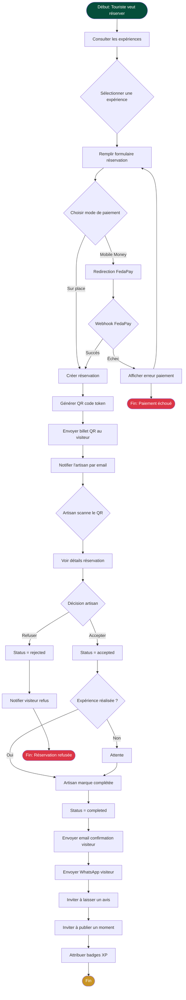
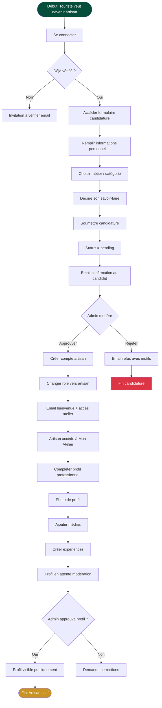
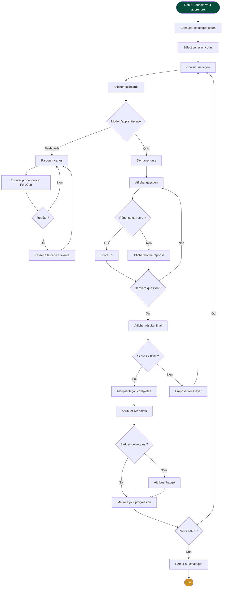
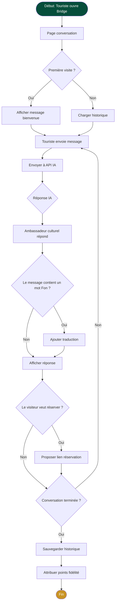
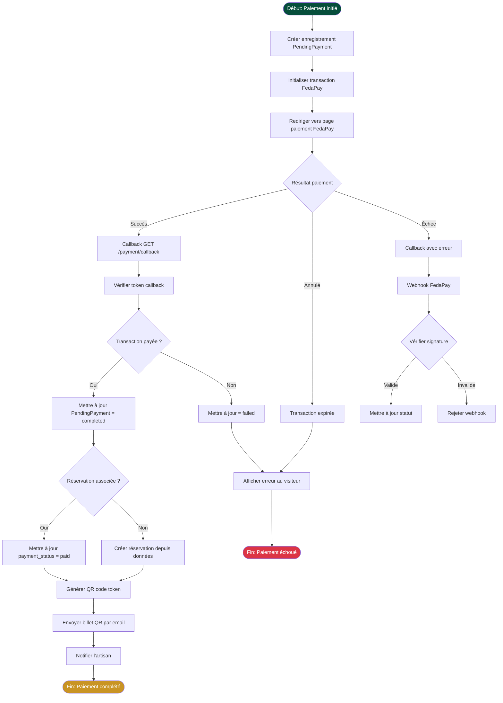
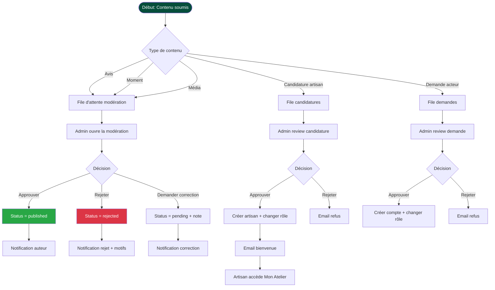

# Diagramme d'Activité — Flux Principaux ƉƆKUN

## 1. Flux Réservation Complet (Visiteur → Artisan → Complétion)

---

## 2. Flux Candidature Artisan

---

## 3. Flux Apprentissage (ƉƆKUN Learn)

---

## 4. Flux Bridge (Conversation IA)

---

## 5. Flux Paiement FedaPay

---

## 6. Flux Modération Admin

